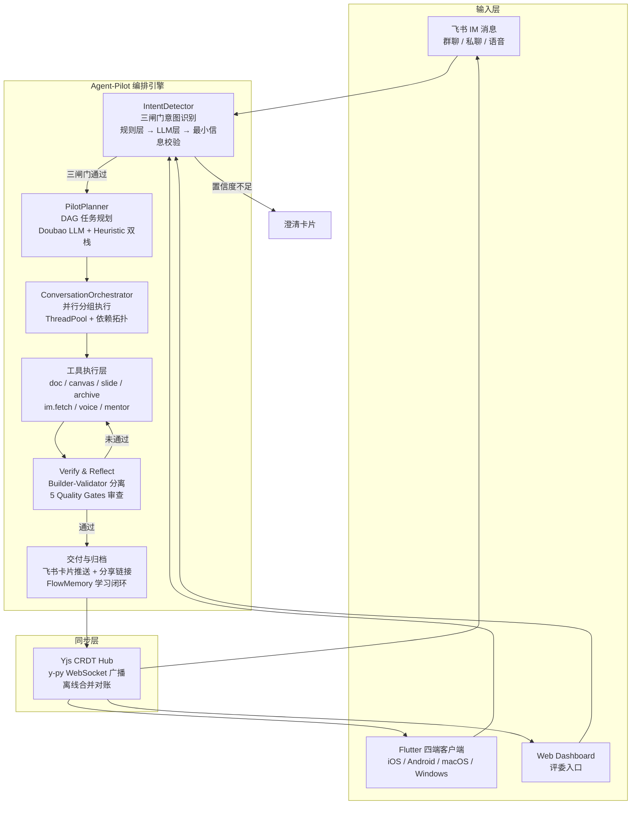

# Agent-Pilot

> 从 IM 对话到演示稿的一键智能闭环 — AI Agent 主驾驶，GUI 为仪表盘

[](https://github.com/bcefghj/Agent-Pilot/actions)
[](https://python.org)
[](LICENSE)
[]()

---

## 项目定位

Agent-Pilot 是一个运行在飞书 IM 中的 AI Agent 系统。它主动监听群聊与私聊消息，通过三闸门意图识别自动发现任务，利用 DAG 编排引擎规划并执行文档、白板、演示稿的完整生成工作流，通过 5 个命名 Agent（Researcher / Debater / Validator / Citation / Mentor）协同完成高质量产出，最终经 Yjs CRDT 实现移动端与桌面端的实时同步交付。Agent 是主驾驶（Pilot），GUI 是仪表盘（Dashboard）——用户只需在 IM 中正常讨论，Agent-Pilot 即可将对话转化为可交付的专业产出物。

---

## 系统架构



---

## 核心特性

| 评分维度 | Agent-Pilot 实现 | 关键模块 |
|---------|-----------------|---------|
| 完整性与价值 | 覆盖赛题 A-F 全部 6 场景；从意图识别到归档交付的完整闭环；Flutter 四端 + Web Dashboard 多端同步 | `core/agent_pilot/` · `core/sync/` · `mobile_desktop/` |
| 创新性 | 三闸门主动任务发现（无需显式指令）；6 级 Memory 真实注入 system prompt；学习闭环 3 次相似任务自动生成 SKILL.md；cardkit.v1 流式打字机卡片 | `intent_detector.py` · `memory_inject.py` · `learner.py` · `cards_pilot.py` |
| 技术实现性 | 5 命名 Agent 协同（Builder-Validator 严格分离）；DAG 并行编排引擎；8 层安全栈全链路必经；Promptfoo 红队 32/32 通过；480+ pytest 全通过 | `multi_agent_pipeline.py` · `orchestrator.py` · `core/security/` · `tests/` |

四个评委 Wow 点：

1. **Streaming 流式打字机** — LLM `chat_stream()` + cardkit.v1 patch，生成过程中评委即可看到内容逐步呈现
2. **3-Tier Prompt Cache** — 借鉴 Claude Code 架构，Role+Tools / Memory+Rules / Env 三层缓存，降低 90% 重复 prompt 开销
3. **多 Agent 实时辩论** — 正方/反方/调停者 三角辩论 + Judge 裁决，全过程飞书卡片实时展示
4. **6 级 Memory 真实注入** — Enterprise → Workspace → Department → Group → User → Session 自动合并到 system prompt，学习闭环 SKILL.md 自动生成

---

## 技术栈

| 层 | 技术选型 |
|---|---------|
| 后端框架 | Python 3.10+ · FastAPI · lark-oapi（飞书官方 SDK，WebSocket 长连接） |
| 前端展示 | Flutter 四端一套代码（iOS/Android/macOS/Windows）· Tiptap 富文本 · tldraw 白板 |
| AI 能力 | MiMo（主力）· 豆包 Doubao · MiniMax · DeepSeek · Kimi · OpenAI Function Calling · MCP 协议 |
| 推理模式 | ReAct · Reflection · CoT · Debate · Tree-of-Thoughts（根据意图自动选择） |
| 多 Agent | Fan-out · Pipeline · Map-Reduce · Specialist Delegation（4 种协同模式） |
| 多端同步 | Yjs y-py CRDT Hub · WebSocket 广播 · 离线日志合并对账 |
| 存储 | SQLite + JSON（2C2G 友好）· Doubao Embedding + BM25 检索兜底 |
| 安全 | 8 层栈：Permission → Injection → Hook → PII → Denylist → RateLimit → Sandbox → Audit |
| 部署 | Docker · systemd × 3 · Nginx 反代 · Prometheus 可观测 · 一键部署 + 自动回滚 |

---

## 快速开始

```bash
# 1. 克隆仓库
git clone https://github.com/bcefghj/Agent-Pilot.git
cd Agent-Pilot

# 2. 安装依赖
python3 -m venv .venv && source .venv/bin/activate
pip install -r requirements.txt

# 3. 配置环境变量
cp .env.example .env
# 编辑 .env，填入以下内容：
#   FEISHU_APP_ID=cli_xxxxxxxxx        ← 飞书开放平台获取
#   FEISHU_APP_SECRET=xxxxxxxx          ← 飞书开放平台获取
#   ARK_API_KEY=ark-xxxxxxxxxxxx        ← 火山方舟获取
#   ARK_MODEL=doubao-seed-2.0-pro
# 详细获取方式见 FEISHU_SETUP.md

# 4. 验证环境（可选）
PYTHONPATH=. pytest tests/ -q --ignore=tests/e2e --ignore=tests/simulator

# 5. 启动全部服务（推荐）
bash run_services.sh
# 一次性启动 3 个进程：Bot + Dashboard + MCP Server
# Dashboard:    http://localhost:8001
# Pilot 驾驶舱: http://localhost:8001/v12/dashboard
# DAG 可视化:   http://localhost:8001/v12/dag/{plan_id}
# API 文档:     http://localhost:8001/docs
# MCP Server:   http://localhost:8767

# 仅启动飞书 Bot（不含 Dashboard 和同步服务）
# python main.py

# 6. 在飞书中体验
# 私聊 Bot 发送：/pilot 把本周讨论整理成产品方案 + 评审PPT
```

Docker 一键启动：

```bash
docker-compose up -d
```

飞书 Bot 支持的评委指令：

| 指令 | 效果 |
|------|------|
| `/pilot <意图>` | 全链路编排：意图识别 → 规划 → 生成 → 交付 |
| `/plan <意图>` | 仅规划不执行，查看 DAG 拆解结果 |
| `/context` | 查看 5 层压缩 + 4 层记忆 + 7 层安全快照 |
| `/model <provider>` | 一键切换 豆包 / MiniMax / DeepSeek / Kimi |
| `/swarm <话题>` | 召唤多 Agent 辩论并收敛结论 |

---

## 项目结构

```
Agent-Pilot/
├── main.py                     # 主入口：飞书 WebSocket 长连接 + 定时任务
├── config.py                   # 环境变量配置
├── requirements.txt            # 依赖（8 个核心包）
│
├── bot/                        # 飞书 Bot 接口层
│   ├── event_handler.py        #   消息事件分发 + 卡片回调
│   ├── cards_pilot.py          #   9 张 Pilot 交互卡片（含权限确认 + DAG 可视化）
│   └── pilot_router.py         #   IM → 状态机路由
│
├── core/agent_pilot/           # Pilot 编排核心
│   ├── domain/                 #   状态机 · Owner · ContextPack
│   ├── application/            #   IntentDetector · Planner · Orchestrator
│   │                           #   MultiAgentPipeline · MemoryInject · Learner
│   └── tools/                  #   doc / canvas / slide / archive / voice / im
│
├── core/security/              # 8 层安全栈
├── core/flow_memory/           # 6 级 Memory 引擎
├── core/sync/                  # Yjs CRDT 多端同步
├── core/mentor/                # Mentor 表达带教（4 Skills）
├── core/feishu_cli/             # 飞书 CLI 24 Skills 集成（200+ 命令）
├── core/mcp_server/            # MCP 协议 Server（21 工具）
│
├── llm/                        # LLM 调用层（OpenAI 兼容）
├── dashboard/                  # Web Dashboard（FastAPI）
├── mobile_desktop/             # Flutter 四端客户端
├── agent/                      # 推理模式 + 验证器
│   ├── patterns/               #   ReAct / Reflection / CoT / Debate / ToT
│   └── validators/             #   critic / citation / quality_gates / risk
│
├── tests/                      # 480+ pytest 用例
│   └── promptfoo/              #   红队测试 32/32 OWASP LLM Top 10
└── deploy/                     # 一键部署 + 自动回滚脚本
```

---

## 6 场景模块映射

| 场景 | 说明 | 核心模块 | 触发方式 |
|-----|------|---------|---------|
| A - 意图入口 | 飞书 IM 文本/语音，主动识别任务 | `intent_detector.py` · `voice_tool.py` | 自然对话 / `/pilot <意图>` |
| B - 任务规划 | DAG 拆解，自动澄清缺失信息 | `planner.py` · `context_service.py` | 三闸门通过后自动触发 |
| C - 文档与白板 | 飞书 Docx API + tldraw 画板双写 | `doc_tool.py` · `canvas_tool.py` | 规划节点自动执行 |
| D - 演示稿生成 | LLM 生成大纲 → Slidev/飞书 Slides → PPTX + 演讲稿 | `slide_tool.py` | 规划节点自动执行 |
| E - 多端同步 | Yjs CRDT Hub，四端实时广播 | `crdt_hub.py` · `ws_server.py` | 任意端修改自动同步 |
| F - 归档交付 | Manifest 汇总 + 飞书摘要 + 分享页 | `archive_tool.py` | 全部节点完成后触发 |

---

## API 要点

| 端点 | 方法 | 说明 |
|------|-----|------|
| `/health` | GET | 服务健康检查 |
| `/api/pilot/start` | POST | 启动 Pilot 编排（传入意图文本） |
| `/api/pilot/status/{plan_id}` | GET | 查询 DAG 执行进度与各节点状态 |
| `/api/pilot/plans` | GET | 列出历史编排记录 |
| `/api/memory/resolve` | POST | 6 级 Memory 合并查询 |
| `/api/context` | GET | 5 层压缩 + 4 层记忆 + 7 层安全快照 |
| `/api/skills` | GET | 22 官方 + N 自动生成技能列表 |
| `/api/quality/{plan_id}` | GET | 5 Quality Gates 评分详情 |
| `/api/pilot/trace/{plan_id}` | GET | 执行追踪：步骤级耗时/Token/重试详情 |
| `/api/pilot/cost` | GET | 成本汇总：Token 总量与费用统计 |
| `/sync/ws` | WebSocket | Yjs CRDT 多端同步通道 |
| `/v12/dashboard` | GET | Pilot v12 驾驶舱主入口 |
| `/v12/dag/{plan_id}` | GET | DAG 可视化（步骤详情 + 实时日志流） |
| `/docs` | GET | OpenAPI 自动生成文档 |

完整 API 文档启动后访问 `http://localhost:8001/docs` 查看。

---

## 量化指标

| 指标 | 数值 |
|------|------|
| pytest 用例 | 480+，全部通过 |
| Promptfoo 红队 | 32/32 通过（OWASP LLM Top 10） |
| A/B 真实 LLM 调用 | 5 配置 × 3 模型 × 5 任务 = 75 次 |
| 飞书 API 接入 | 7+（IM / Docx / Bitable / Calendar / Wiki / 妙记 / Reaction） |
| MCP 工具 | 21 内建 + 24 飞书 CLI Skills（200+ 命令） |
| 安全栈层数 | 8 层全链路必经 |
| 部署成本 | 2C2G 起步 |

---

## 比赛信息

本项目为 **飞书 AI 校园挑战赛** 参赛作品，对齐课题二「基于 IM 的办公协同智能助手」。

- 赛题核心要求：从一次 IM 对话开始，Agent 自动串联 IM + 文档 + 演示稿/画布，实现多端实时同步的全链路自动化
- 在线体验：http://118.178.242.26/
- Pilot 驾驶舱：http://118.178.242.26/v12/dashboard
- 技术文档：[架构文档](docs/ARCHITECTURE_v8.md) · [PRD 实现地图](docs/PRD_IMPLEMENTATION.md) · [演化历程](docs/EVOLUTION.md) · [Demo 脚本](docs/DEMO_SCRIPT.md)

| 成员 | 角色 | 联系 |
|------|------|------|
| [戴尚好](https://bcefghj.github.io) | 全栈开发 / Agent 安全 / 部署 / 答辩 | bcefghj@163.com |
| [李洁盈](https://janeliii.netlify.app/) | 产品设计 / UI·UX / 内容运营 / 演讲 | JieyingLiii@outlook.com |

---

## License

[MIT License](LICENSE) · Copyright © 2026 戴尚好 & 李洁盈
