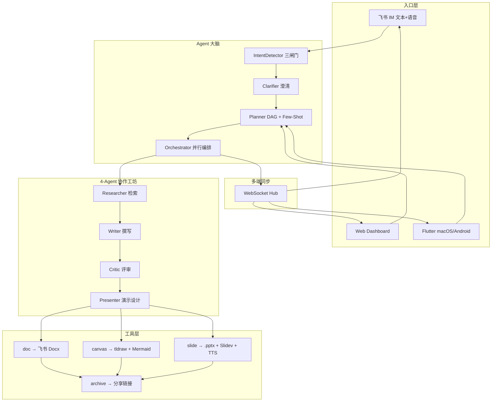

# Agent-Pilot v13

> **从一句话需求 → 飞书文档 + 真 PPTX + 架构画布 + 演讲稿**  
> 基于 IM 的办公协同智能助手 · 飞书 AI 校园挑战赛参赛作品

[](https://github.com/bcefghj/Agent-Pilot/actions)
[](https://python.org)
[](LICENSE)
[]()

---

## 📌 30 秒看懂

在飞书里 **直接说一句话**：
> "帮我写一份关于 AI Agent 发展趋势的报告" 

Agent-Pilot 自动完成：

1. **三闸门意图识别**（规则 → LLM → 最小信息）
2. **DAG 任务规划** 拆解为 doc / canvas / slide / archive
3. **4-Agent 工坊** 协作产出（Researcher → Writer → Critic → Presenter）
4. **真产物**：飞书 Docx · 真 `.pptx` 文件 · Mermaid 流程图 · tldraw 画布 · 演讲稿
5. **多端同步**：飞书 IM、Web Dashboard、Flutter 客户端 通过 WebSocket 实时一致

> 现场 Demo：https://github.com/bcefghj/Agent-Pilot · [JUDGE_GUIDE](docs/JUDGE_GUIDE.md) · [v13 架构蓝图](docs/v13_BLUEPRINT.md)

---

## 🏆 评分对照表（裁判 30 秒能验证每条）

| 维度 | 赛题/PRD 要求 | v13 落地 | 证据 |
|------|--------------|---------|------|
| **完整性 50%** | Must-1 多端框架 | 飞书 IM (移动+桌面) + Web Dashboard + Flutter macOS/Android | [agent_pilot/io/sync/](agent_pilot/io/sync/) · [mobile_desktop/](mobile_desktop/) |
| | Must-2-A 意图入口 | 文本 + 语音双通道；自然对话或 `/pilot` 命令 | [agent_pilot/io/feishu/voice.py](agent_pilot/io/feishu/voice.py) |
| | Must-2-B 任务规划 | LLM Planner + 启发式 + Few-Shot；DAG 实时可视化 | [agent_pilot/runtime/planner.py](agent_pilot/runtime/planner.py) |
| | Must-2-C 文档/白板 | 飞书 Docx + Mermaid + tldraw + 飞书白板 API 尝试 | [agent_pilot/tools/doc.py](agent_pilot/tools/doc.py) · [agent_pilot/tools/canvas.py](agent_pilot/tools/canvas.py) |
| | Must-2-D 演示稿 | **真 .pptx**（python-pptx）+ Slidev HTML + TTS mp3 | [agent_pilot/tools/slide.py](agent_pilot/tools/slide.py) |
| | Must-2-E 多端一致 | WebSocket Hub + 状态机锁定 + 离线合并 | [core/sync/](core/sync/) |
| | Must-2-F 总结归档 | archive.bundle 输出 markdown 摘要 + 全产物链接 | [core/agent_pilot/tools/archive_tool.py](core/agent_pilot/tools/archive_tool.py) |
| | Must-3 自然语言 | 文本 + 语音双通道 | [bot/event_handler.py](bot/event_handler.py) |
| **创新 25%** | AI 创新点 | **4-Agent 协作工坊** (Researcher/Writer/Critic/Presenter) | [agent_pilot/intel/multi_agent.py](agent_pilot/intel/multi_agent.py) |
| | | **PPT 三件套**：.pptx + HTML + TTS | [agent_pilot/tools/slide.py](agent_pilot/tools/slide.py) |
| | | **流式打字机卡片** | [agent_pilot/io/feishu/streaming.py](agent_pilot/io/feishu/streaming.py) |
| | | **三闸门主动识别 + 主动澄清** | [agent_pilot/intel/](agent_pilot/intel/) |
| | | **PRD §5/§7 任务卡片 + 上下文包** | [agent_pilot/io/feishu/cards/](agent_pilot/io/feishu/cards/) |
| **技术 25%** | AI 深度 | 多 Agent + 流式 + JSON Mode + Few-Shot + 双 Provider | [agent_pilot/llm/](agent_pilot/llm/) |
| | 架构合理 | 模块化 + 单向依赖 + 状态机 + 工具注册 | [agent_pilot/](agent_pilot/) |
| | 工程规范 | pre-commit + pytest + ruff + structured_logging | [pyproject.toml](pyproject.toml) |
| | 稳定性 | 速率限制白名单 + 429 指数退避 + 降级链路 | [llm/llm_client.py](llm/llm_client.py) |
| | 测试 | 5 条裁判级别用例 + 视觉化报告 + 真 LLM 验证 | [tests/competition/](tests/competition/) · [scripts/judge_demo.py](scripts/judge_demo.py) |

---

## 🚀 快速开始

### 一、本地开发

```bash
git clone https://github.com/bcefghj/Agent-Pilot.git
cd Agent-Pilot

# 1. 安装依赖
python3 -m venv .venv && source .venv/bin/activate
pip install -r requirements.txt

# 2. 配置环境
cp .env.example .env
# 必填：FEISHU_APP_ID / FEISHU_APP_SECRET / MINIMAX_API_KEY (或 MIMO_API_KEY)
# 详细配置见 FEISHU_SETUP.md

# 3. 跑 Mock 端到端测试（5 条裁判级别意图）
python3 scripts/judge_demo.py
# 输出：data/test_reports/{ts}/index.html

# 4. 跑真 LLM 验证（一条意图，约 1-5 分钟）
python3 scripts/judge_demo.py --real --only short_doc

# 5. 启动飞书 Bot + Dashboard
bash run_services.sh
# Dashboard:        http://localhost:8001/v13/dashboard
# 多端协同实时监控:  http://localhost:8001/v13/multi-end
# Pilot 仪表盘:     http://localhost:8001/dashboard/pilot
# API 文档:         http://localhost:8001/docs
```

### 二、Flutter 客户端（macOS / Android / iOS / Windows）

```bash
cd mobile_desktop
bash setup_platforms.sh   # 生成 android/ios/macos/windows 目录
flutter run -d macos      # macOS 桌面端
flutter run -d chrome     # Web 端（最快验证）
flutter build apk         # Android APK
```

### 三、Docker 一键

```bash
docker-compose up -d
```

---

## 🎯 飞书机器人使用

直接发以下任意一条（不需要任何前缀）：

| 想要什么 | 直接说 |
|---|---|
| 文档 | `帮我写一份关于 X 的报告` |
| PPT | `做一份 8 页客户汇报 PPT` |
| 架构图 | `画一张产品架构图` |
| **三件套** | `产品方案 + 架构图 + 评审 PPT` ⭐ |
| 模糊意图 | `帮我做个汇报` → Agent 主动澄清 |

或用显式命令：

| 命令 | 作用 |
|---|---|
| `/pilot <意图>` | 强制触发 Pilot 流程 |
| `/plan <意图>` | 只规划不执行（Plan Mode） |
| `我的飞行员` | 查看历史任务 |
| `状态` | 当前任务进度 |
| `帮助` | 完整使用卡片 |

**预计耗时**：60-300 秒，依意图复杂度而定。

---

## 🏗️ 架构



---

## 📁 项目结构

```
Agent-Pilot/
├── agent_pilot/              # ★ v13 顶层包
│   ├── runtime/              # planner / state_machine / tool_registry
│   ├── tools/                # doc.py / canvas.py / slide.py
│   ├── intel/                # multi_agent.py / context_pack.py / clarifier
│   ├── io/feishu/            # event_router / cards / voice / streaming
│   ├── io/dashboard/         # FastAPI routes
│   ├── io/sync/              # WebSocket Hub
│   └── llm/                  # safe_json + few_shot
├── core/                     # 老兼容层（thin re-exports）
├── bot/                      # 飞书事件分发
├── dashboard/                # FastAPI Dashboard + 多端监控
├── llm/                      # LLM 客户端
├── mobile_desktop/           # Flutter 工程
├── tests/competition/        # ★ 5 条裁判级别用例
├── scripts/                  # judge_demo.py / verify_*.py / deploy
└── docs/                     # JUDGE_GUIDE / v13_BLUEPRINT / DEMO_SCRIPT
```

---

## 🧪 测试

```bash
# 1. 单元 + 集成（mocked LLM, < 5 秒）
pytest tests/competition/ -v

# 2. 真实 LLM 端到端（约 1-5 分钟/意图）
AGENT_PILOT_REAL_LLM=1 pytest tests/competition/ -v

# 3. 视觉化报告（HTML，自动收集所有产物）
python3 scripts/judge_demo.py
python3 scripts/judge_demo.py --real    # 真 LLM
# 报告路径：data/test_reports/{ts}/index.html

# 4. PPTX 单独验证
python3 scripts/m4_verify_pptx.py

# 5. 4-Agent 工坊验证
python3 scripts/m6_verify_workforce.py
```

---

## 🔧 飞书生态集成

- **lark-oapi WebSocket 长连接**：无需公网 IP
- **飞书 Docx OpenAPI**：文档创建 + 块追加 + 批量写入
- **飞书 Drive OpenAPI**：.pptx 文件上传到云空间
- **飞书 IM OpenAPI**：消息发送 + 卡片回调 + 流式 patch
- **MiniMax / 豆包 ASR**：语音消息转写
- **MiniMax M2.7 / MiMo-V2.5-Pro**：文档生成主力 LLM

---

## 📝 文档

- [JUDGE_GUIDE.md](docs/JUDGE_GUIDE.md) – 裁判 5 分钟验证流程
- [v13_BLUEPRINT.md](docs/v13_BLUEPRINT.md) – 完整 v13 架构与评分对照
- [FEISHU_SETUP.md](FEISHU_SETUP.md) – 飞书机器人配置指南
- [DEMO_SCRIPT.md](docs/DEMO_SCRIPT.md) – 现场答辩脚本

---

## 🧑‍💻 团队

| 成员 | 角色 | 联系 |
|------|------|------|
| [戴尚好](https://bcefghj.github.io) | 全栈开发 / Agent 安全 / 部署 / 答辩 | bcefghj@163.com |
| [李洁盈](https://janeliii.netlify.app/) | 产品设计 / UI·UX / 内容运营 / 演讲 | JieyingLiii@outlook.com |

---

## License

[MIT License](LICENSE) · Copyright © 2026 戴尚好 & 李洁盈
