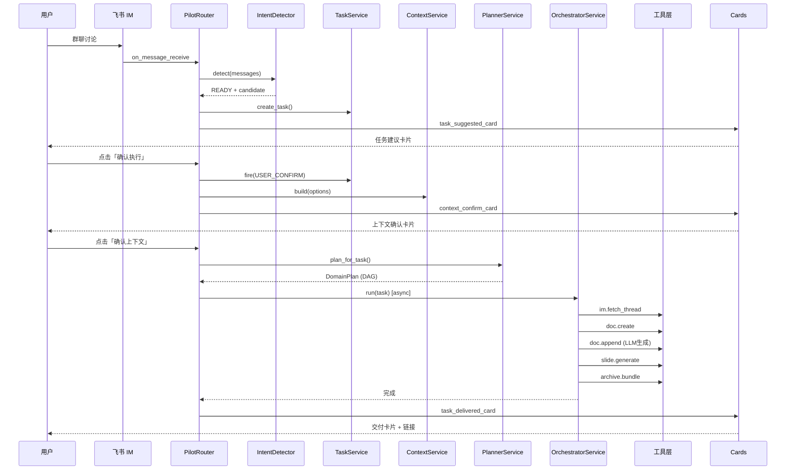
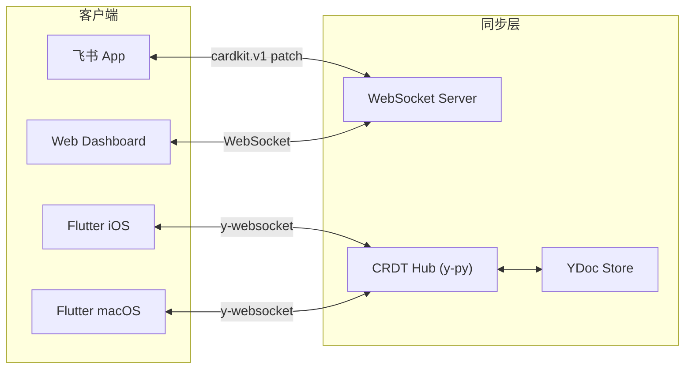

# Agent-Pilot v8 架构文档

## v8 新增架构组件

| 组件 | 位置 | 说明 |
|------|------|------|
| SafetyScanner | `core/agent_pilot/harness/safety_scanner.py` | 工具调用前安全预检：关键词扫描 + PII检测 + 破坏性拦截 |
| FeatureFlags | `core/agent_pilot/harness/feature_flags.py` | 轻量级运行时特性开关，支持环境变量/JSON/API三级 |
| ToolSchemas | `core/agent_pilot/tool_schemas.py` | OpenAI function calling 工具定义 |
| MCPConfig | `core/feishu_cli/mcp_config.py` | 飞书 MCP 服务器配置 + 24 Skills 声明 |
| RequestIDMiddleware | `dashboard/server.py` | X-Request-ID 请求追踪 |
| OptionalAPIKeyMiddleware | `dashboard/server.py` | 可选 API Key 鉴权 |

## 1. 系统架构总览

```mermaid
graph TB
    subgraph Client["客户端"]
        IM["飞书 IM"]
        Flutter["Flutter 4端"]
        Dashboard["Web Dashboard"]
    end

    subgraph Bot["Bot 层"]
        EventHandler["event_handler.py"]
        PilotRouter["pilot_router.py"]
        CardsPilot["cards_pilot.py"]
    end

    subgraph Application["应用服务层 (DDD)"]
        IntentDetector["IntentDetector 三闸门"]
        TaskService["TaskService"]
        ContextService["ContextService"]
        PlannerService["PlannerService 5模式"]
        OrchestratorService["OrchestratorService"]
        MultiAgent["MultiAgentPipeline"]
        Learner["PilotLearner"]
    end

    subgraph Domain["领域层"]
        TaskEntity["Task 聚合根"]
        StateMachine["StateMachine 12状态"]
        ContextPack["ContextPack 7字段"]
        OwnerLock["OwnerLock"]
        EventBus["EventBus"]
    end

    subgraph AgentHarness["Agent Harness (v8)"]
        AgentLoop["AgentLoop 9步"]
        Providers["Providers 4模型"]
        Permissions["PermissionGate"]
        Hooks["HookSystem"]
        Memory["6层 FlowMemory"]
        Skills["Skills Loader"]
        MCP["MCP Manager"]
        Safety["SafetyScanner"]
        FF["FeatureFlags"]
        FuncCall["Function Calling"]
    end

    subgraph Tools["工具层"]
        DocTool["doc.create/append"]
        SlideTool["slide.generate/rehearse"]
        CanvasTool["canvas.create/add_shape"]
        IMTool["im.fetch_thread"]
        ArchiveTool["archive.bundle"]
        LarkCLI["Lark CLI Skills"]
    end

    subgraph Infra["基础设施"]
        CRDTHub["CRDT Hub (y-py)"]
        Security["8层安全栈"]
        SQLite["SQLite + FTS5"]
        Feishu["飞书 Open API"]
    end

    IM --> EventHandler --> PilotRouter
    Flutter --> Dashboard
    Dashboard --> Application

    PilotRouter --> IntentDetector
    PilotRouter --> TaskService
    PilotRouter --> ContextService
    PilotRouter --> CardsPilot

    TaskService --> TaskEntity
    TaskEntity --> StateMachine
    TaskEntity --> OwnerLock
    TaskEntity --> EventBus

    ContextService --> ContextPack
    PlannerService --> OrchestratorService
    OrchestratorService --> Tools
    OrchestratorService --> AgentLoop

    AgentLoop --> Providers
    AgentLoop --> Permissions
    AgentLoop --> Hooks
    AgentLoop --> Memory
    AgentLoop --> MCP

    Tools --> Feishu
    Tools --> LarkCLI
    CRDTHub --> Flutter
    EventBus --> Learner
```

## 2. 三线产品架构

| 线 | 角色 | 核心能力 | 代码位置 |
|---|---|---|---|
| @shield | 消息守护 | 6维分类、Recovery Card、紧急熔断 | `core/security/`, `core/smart_shield*.py` |
| @mentor | 表达带教 | 起草、澄清、STAR周报、新人5问 | `core/mentor/` |
| @pilot | 主驾驶 | 意图识别、任务编排、Doc/PPT/Canvas | `core/agent_pilot/` |

三线合体点：
1. 共享组织知识库 (FlowMemory)
2. Recovery Card UI (Shield拦截 + Pilot识别 + Mentor起草)
3. 学习闭环 (Learner 自动生成 SKILL.md)

## 3. 数据流

### 3.1 主流程 (IM -> Doc -> PPT)

### 3.2 多端同步

## 4. 安全架构

10 层安全栈（全链路必经，不允许快速路径绕过）：

1. **PermissionManager** - 5级权限 + Allow/Deny/Ask 三态
2. **TranscriptClassifier** - 正则 + LLM prompt injection 检测
3. **HookSystem** - 9 lifecycle hooks
4. **PIIScrubber** - 敏感信息脱敏
5. **KeywordDenylist** - 关键词黑名单
6. **RateLimiter** - 频率限制
7. **ToolSandbox** - 工具调用沙箱
8. **AuditLog** - JSONL append-only 审计
9. **SafetyScanner** (v8新增) - 工具调用前安全预检：关键词扫描 + PII检测
10. **FeatureFlags** (v8新增) - 运行时开关，控制高风险功能灰度发布

## 5. 推理模式选择

| 模式 | 触发条件 | 适用场景 |
|---|---|---|
| ReAct | 短指令(<25字) + 单一动作 | 快速执行 |
| CoT | 默认中等任务 | 标准文档生成 |
| Reflection | must_validate=True 或审查关键词 | 质量敏感任务 |
| Debate | 辩论/决策/权衡关键词 | 多方案对比 |
| ToT | 探索/分支/对比方案关键词 | 创新方案设计 |

## 6. 技术栈

| 层 | 技术 |
|---|---|
| 后端 | Python 3.10+, FastAPI, lark-oapi |
| LLM | 豆包/MiniMax/DeepSeek/Kimi (4供应商路由) |
| 实时同步 | WebSocket + y-py CRDT |
| 存储 | SQLite + FTS5 + JSON 事件溯源 |
| 前端 | Flutter 3.16+ (iOS/Android/macOS/Windows) |
| 画布 | tldraw v3 + Yjs |
| 文档 | Tiptap v2 + Yjs |
| CI/CD | GitHub Actions |
| 容器 | Docker + docker-compose |
| 监控 | Prometheus + OpenTelemetry |
| Tool Calling | OpenAI Function Calling (原生) + 正则兜底 |
| 安全 | Safety Scanner + PII Detection + Feature Flags |
| MCP | lark-openapi-mcp (24 Feishu Skills) |
