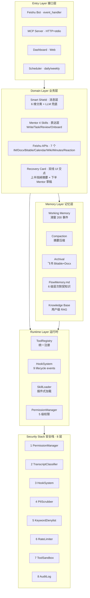
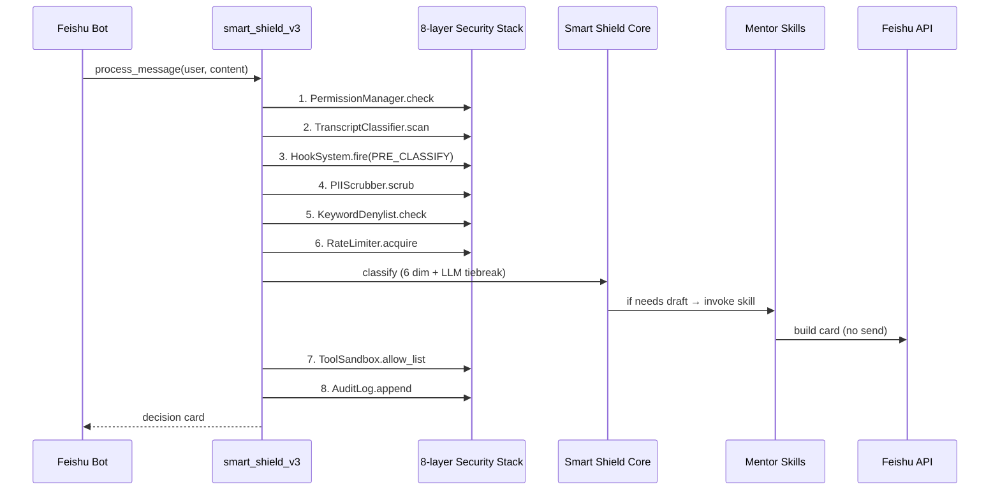
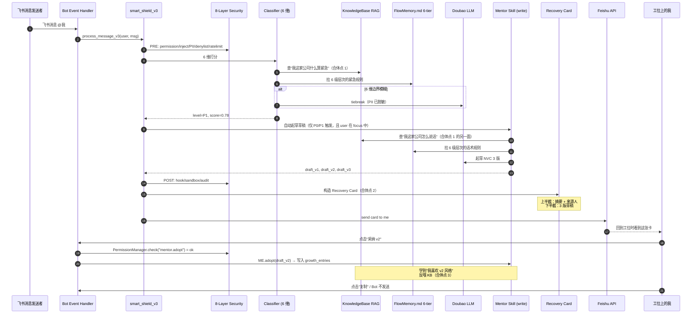

# LarkMentor 架构设计书

> 立意锚定：「工位上同时发生」（详见 [20_docs_internal/07_立意1完整版_工位上同时发生.md](20_docs_internal/07_立意1完整版_工位上同时发生.md)）
> 架构北极星：Anthropic Claude Code 的 7 大核心机制
> 工程现状：82 个 .py 文件 / 11,454 行 Python / 已有 Claude Code 风格雏形
> 工程目标：把"雏形"提炼为统一架构 + 补齐空缺 + 让两条服务线在代码里真合体

---

## 0 · 一句话架构

> **LarkMentor = 一个长在飞书 IM 里的双线 Agent —— 内层走 Claude Code 7 支柱（runtime / memory / domain），外层串联飞书 7 个 API，对外通过 MCP 暴露给所有外部 Agent。**



---

## 1 · Claude Code 7 大支柱借鉴

### 为什么是 Claude Code

Claude Code 是 Anthropic 开源的 51 万行 TypeScript Agent 框架（claude-cli），是目前**最成熟、最被广泛抄袭**的"AI 编程 Agent"参考实现。它的 7 个机制几乎成了行业事实标准：

| Claude Code 机制 | 它解决什么问题 | 行业里谁也在抄 |
|---|---|---|
| 1 ToolRegistry | Agent 如何描述/查找/调用工具 | Cursor / Cline / Aider |
| 2 Hook System (Pre/Post) | 用户/企业如何在不改代码的情况下注入策略 | Cursor hooks / Anthropic Hooks API |
| 3 Skills | 如何让能力可拔插、按需加载 | OpenAI GPTs / 飞书 Aily |
| 4 Permission Manager | 如何在 Agent 时代做"deny by default" | LangChain / Agent Squad |
| 5 6-tier Memory (CLAUDE.md) | 跨会话上下文如何分层覆盖 | Cursor rules / Continue.dev |
| 6 MCP Native | Agent 如何被其他 Agent 调用 | 整个 Anthropic 生态 |
| 7 AuditLog | Agent 行为如何被审计/重放 | 企业必需 |

LarkMentor **已经有这 7 个机制的雏形**（不是从零）。这次架构升级是**把雏形提炼为统一框架**，而不是发明轮子。

### 7 支柱在 LarkMentor 中的现状 vs 目标

| # | 支柱 | 现状（v1） | 目标（v2）| 关键文件 |
|---|---|---|---|---|
| 1 | ToolRegistry | 散落在 [core/mcp_server/tools.py](40_code/project/core/mcp_server/tools.py) | 抽出独立 [core/runtime/tool_registry.py](40_code/project/core/runtime/tool_registry.py)，所有 domain 调用必经 | mcp_server/tools.py |
| 2 | HookSystem | [core/security/hook_system.py](40_code/project/core/security/hook_system.py) 9 事件已实现 | 全链路覆盖：消息/草稿/采纳/恢复/MCP 调用 | security/hook_system.py |
| 3 | SkillLoader | mentor 4 模块直接 import | 改造为可拔插 Skill（注册表 + 元数据） | mentor/* |
| 4 | PermissionManager | [core/security/permission_manager.py](40_code/project/core/security/permission_manager.py) 5 级 + 25 工具 | 全链路 enforce，包括 LLM call 前 | security/permission_manager.py |
| 5 | 6-tier Memory | [core/flow_memory/flow_memory_md.py](40_code/project/core/flow_memory/flow_memory_md.py) resolver 已写但未注入 | 真正注入 Smart Shield + Mentor system prompt | flow_memory/flow_memory_md.py |
| 6 | MCP Native | server + 8 工具已暴露 | 加 `classify_readonly` + `skill_invoke` + `memory_resolve` | mcp_server/* |
| 7 | AuditLog | append-only JSONL 已实现 | 全链路写 + 加 Web 可视化 | security/audit_log.py |

---

## 2 · 关键设计原则（不可违反）

### 原则 1 · 所有 domain 调用必经 ToolRegistry

```python
# ❌ 旧风格：domain 直接调 LLM 或飞书 API
from core.mentor.mentor_write import draft_reply
draft = draft_reply(user, content)

# ✅ 新风格：必经 ToolRegistry（自动 enforce 权限+审计+限速）
from core.runtime import tool_registry
draft = tool_registry.invoke(
    "mentor.write",
    {"user_open_id": user.open_id, "content": content},
)
```

理由：让"双线产品"在工程层面真的合体——任何调用都通过同一道关卡。Claude Code 的核心哲学就是这个。

### 原则 2 · "草稿不发送" 是不可破的硬约束

任何 mentor.* tool 永远只返回 draft，永远没有 send 路径。需要发送的动作（reply / docx / bitable）必须经过：
1. PermissionManager 检查（≥ DRAFT_ACTION）
2. 用户在 Recovery Card / 卡片上显式点击"采纳"
3. 进入 SEND_ACTION 工具（需要 user_level ≥ SEND_ACTION）

理由：合规底线 + 评委 Q&A 兜底 + 用户信任。

### 原则 3 · 双线在工程上必须有 3 个真实合体点

| 合体点 | 工程实现 | 文件 |
|---|---|---|
| 1 同一份组织默契知识 | classifier.py 调 knowledge_base.py 查"组织语境分" + mentor.write 调同一份 KB 查"组织风格" | [shield/classifier.py](40_code/project/core/shield/classifier.py) + [mentor/knowledge_base.py](40_code/project/core/mentor/knowledge_base.py) |
| 2 Recovery Card UI 唯一交点 | 一张卡，上半截"我替你挡了什么"+ 下半截"我替你起草了什么" | [shield/recovery_card.py](40_code/project/core/shield/recovery_card.py) ⭐ 新建 |
| 3 同一份 FlowMemory 共同学习 | Shield 学发件人偏好 + Mentor 学采纳偏好 → 同一个 working_memory.json | [memory/working.py](40_code/project/core/memory/working.py) |

**这 3 个点是"双线产品"叙事的工程兑现。少一个，立意就站不住。**

### 原则 4 · 安全栈 8 层全链路必经

不允许任何"快速路径"绕过 8 层栈。所有消息进入 Bot → 全部走 `process_message_v3`。



### 原则 5 · 6-tier Memory 默认开启，按需覆盖

每次 system prompt 构造时，自动从 6 级层次合并：
```
Enterprise → Workspace → Department → Group → User → Session
```
低层覆盖高层。每层是一个 markdown 文件，企业管理员/部门/用户可独立维护。

### 原则 6 · 名字一致性

- 模块名/文件名/类名/MCP 工具名：`mentor_*`（不是 coach_*）
- 旧 `coach_*` MCP 工具保留为 alias，2 个版本后删除
- 文档话术：**永远不说"对齐字节 Mentor 4 大职责"**（见 §6）

### 原则 7 · 测试金字塔

```
       /\
      /  \    Promptfoo 红队 (50+ 攻击用例)
     /----\
    /      \  端到端 (8 个用户场景, 录屏)
   /--------\
  /          \  集成测试 (pytest, 12 个场景)
 /------------\
/              \  单元测试 (pytest, 119+ 用例, 必须全过)
----------------
```

任何代码改动 → pytest 必须全绿才允许提交。

---

## 3 · 新 core/ 目录结构

```
40_code/project/
├── main.py                         # 入口（不变）
├── core/
│   ├── runtime/                    # 支柱 1-4：内层 ⭐ 新增
│   │   ├── __init__.py             # export ToolRegistry / HookSystem / etc.
│   │   ├── tool_registry.py        # 统一注册中心
│   │   ├── hook_runtime.py         # 与 security/hook_system 的轻量 facade
│   │   ├── skill_loader.py         # Skill 元数据 + 动态加载
│   │   └── permission_facade.py    # PermissionManager 的 facade
│   ├── memory/                     # 支柱 5：FlowMemory 中层 ⭐ 改名（原 flow_memory）
│   │   ├── __init__.py
│   │   ├── working.py
│   │   ├── compaction.py
│   │   ├── archival.py
│   │   └── flow_memory_md.py       # 6 级层次
│   ├── shield/                     # 双线左线：消息层 ⭐ 改名（原 smart_shield 散乱）
│   │   ├── __init__.py
│   │   ├── classifier.py           # 6 维分类（原 classification_engine）
│   │   ├── llm_tiebreak.py         # LLM 兜底（从 smart_shield 抽出）
│   │   ├── recovery_card.py        # ⭐ 双线交点 - 新建
│   │   ├── sender_profile.py
│   │   └── shield_v3.py            # 主链路（原 smart_shield_v3）
│   ├── mentor/                     # 双线右线：表达层 → Skills
│   │   ├── __init__.py
│   │   ├── write_skill.py          # ⭐ 改名（原 mentor_write）
│   │   ├── task_skill.py
│   │   ├── review_skill.py
│   │   ├── onboard_skill.py
│   │   ├── proactive_hook.py
│   │   ├── knowledge_base.py
│   │   ├── mentor_router.py
│   │   └── growth_doc.py
│   ├── feishu/                     # 飞书 7 API ⭐ 改名（原 feishu_advanced）
│   │   ├── __init__.py
│   │   ├── im.py
│   │   ├── docx.py
│   │   ├── bitable.py
│   │   ├── calendar.py             # 原 calendar_busy
│   │   ├── wiki.py                 # 原 wiki_search
│   │   ├── minutes.py              # 原 minutes_fetch
│   │   ├── reaction.py             # 原 reaction_api
│   │   ├── reply_thread.py
│   │   ├── task_v2.py
│   │   └── urgent_api.py
│   └── security/                   # 支柱 7：8 层栈
│       ├── __init__.py
│       ├── pii_scrubber.py
│       ├── transcript_classifier.py
│       ├── hook_system.py          # 与 runtime/hook_runtime 区分：lifecycle 实现
│       ├── permission_manager.py
│       ├── audit_log.py
│       ├── keyword_denylist.py     # ⭐ 新实现
│       ├── rate_limiter.py         # ⭐ 新实现
│       └── tool_sandbox.py         # ⭐ 新实现
├── mcp/                            # 支柱 6：MCP 接口 ⭐ 提升到顶层
│   ├── __init__.py
│   ├── server.py
│   ├── tools.py                    # 加 classify_readonly / skill_invoke / memory_resolve
│   └── transport.py
├── bot/                            # 飞书 Bot 入口
│   ├── __init__.py
│   ├── event_handler.py            # ⭐ 切到 process_message_v3 主链路
│   └── card_callback.py
├── dashboard/                      # Web 控制台
└── memory_storage/                 # 持久化（加锁）
    ├── user_state.py               # ⭐ 加 fcntl 文件锁
    └── kb_store.py                 # ⭐ 加事务
```

### 兼容性策略（不破坏现有 119 pytest）

1. **import shim**：旧路径 `from core.smart_shield import ...` 保留，内部 re-export 新模块
2. **MCP 工具 alias**：`coach_*` 工具名继续可用，内部转发到 `mentor_*`
3. **数据迁移**：`data/` 目录结构保持，不删旧 working_memory 文件
4. **环境变量**：`.env` 完全兼容，不引入新 key

---

## 4 · 数据流：一条消息的全程



10 个关键点：
1. 全链路必经 8 层安全栈（不绕路）
2. 6 维分类时调 KB（合体点 1）
3. 6 级 memory 注入 system prompt（支柱 5）
4. LLM 调用前 PII 已脱敏（安全 4 层）
5. 自动起草仅在 focus + P0/P1 触发，避免打扰
6. Mentor 写作时调同一份 KB（合体点 1 另一面）
7. Recovery Card 是双线 UI 交点（合体点 2）
8. 永远没有自动发送
9. 用户采纳反喂 KB（合体点 3）
10. 全程 audit_log 记录

---

## 5 · 与现有代码的迁移路径（25 天分 4 周）

### Week 1（4/19-4/25）：架构定稿 + runtime 搭建

- [x] step1 ARCHITECTURE.md（本文档）
- [ ] step2 仓库拆分：larkmentor_bcefghj/ 12 子目录
- [ ] step3 全局清理禁用文案
- [ ] step4 新建 core/runtime/ 4 文件

**关键决策**：runtime 是 facade 层——内部转发到现有 security/hook_system 和 security/permission_manager。**不重写已有逻辑**，只统一对外接口。

### Week 2（4/26-5/2）：核心改进 5-9

- [ ] step5 Recovery Card（双线 UI 交点）
- [ ] step6 event_handler 切 v3 主链路
- [ ] step7 补完 KeywordDenylist / RateLimiter / ToolSandbox
- [ ] step8 user_state + kb_store 加锁
- [ ] step9 mentor 4 模块改造为 Skill
- [ ] step10 MCP 扩展
- [ ] step11 6 级 memory 注入

### Week 3（5/3-5/9）：测试 + 部署 + PDF + 切片

- [ ] step12 30+ 竞品调研
- [ ] step13 评委版 6 PDF 初稿
- [ ] step14 个人版 3 PDF 初稿
- [ ] step15 tectonic 编译
- [ ] step16 4 维测试矩阵
- [ ] step17 FlowMemory 白皮书
- [ ] step18 ShieldClaw 红队
- [ ] step19 阿里云冷切换

### Week 4（5/10-5/14）：演练 + 决赛

- [ ] step20 Pitch + Q&A 演练

---

## 6 · 全局禁用文案清单（禁止任何文档/代码出现）

| 禁用 | 替换为 |
|---|---|
| 对齐字节官方 Mentor 4 大职责 | 双线服务：消息层守护 + 表达层带教 |
| 字节 Mentor 4 大职责 | （删除整句）|
| 字节 7000 实习生 | （删除）|
| 字节 2026 届扩招 25% | （删除）|
| 小王 / 老张 等虚构人物 | 改为"工位上的人"通用代词 |
| 老员工最不会带新人 | （删除，得罪评委）|
| 把字节 Mentor 规范做成 Bot | 把"消息分流 + 表达带教"做成 Bot |

清理动作：在 step3 中用 grep 全局扫描 + Edit 修复。

---

## 7 · 与 Claude Code 的差异（评委可能问）

LarkMentor **不是 Claude Code 的克隆**，是**借鉴 Claude Code 工程哲学，落到飞书 IM 协同场景**。

| 维度 | Claude Code | LarkMentor |
|---|---|---|
| 主战场 | 编程 IDE（VS Code/Cursor 内嵌）| 飞书 IM 群聊 |
| 主任务 | 写代码、改代码、运行命令 | 消息分流 + 表达带教 |
| 工具集 | shell/edit/grep/git/web | feishu_im/docx/bitable/calendar |
| Memory | CLAUDE.md（项目级）| FlowMemory.md 6 级（组织级）|
| Skills | Anthropic Skills 商店 | mentor 4 模块 + 自定义 |
| 协议 | MCP 客户端为主 | MCP server 为主，被外部 Agent 调用 |

**借鉴的是"工程模式"，不是"业务能力"**。

---

## 8 · 评委可能问的 5 个架构问题（兜底答案）

| Q | A |
|---|---|
| 你这是 ChatGPT 套壳吗？ | 7 支柱独立工程 + 8 层安全栈 + 6 级 memory + RAG + MCP，11k 行真代码（[40_code/](40_code/)）。LLM 只在 6 维分类边界模糊（±0.05）和草稿生成时调用，其他都是规则/检索。 |
| 为什么不用 LangGraph / CrewAI？ | 飞书评委关心可部署性。阿里云 2C2G 跑不动重框架。我们用纯 prompt + Python facade，0 框架依赖。Claude Code 也是这个选择。 |
| 双线产品不会精神分裂吗？ | 看本文 §2 原则 3 的 3 个合体点：同一份 KB / Recovery Card UI / 同一份 FlowMemory 共同学习。叙事上叫"工位上同时发生"，工程上叫"一份默契两条服务线"。 |
| 安全栈是不是 PPT？ | 不是。看 [50_tests/02_promptfoo_redteam_report.md](50_tests/02_promptfoo_redteam_report.md) 50+ 攻击用例 + OWASP LLM Top10 映射。step6 完成后主链路必经 8 层。 |
| 为什么叫 LarkMentor 不是 LarkAssistant？ | "Assistant"是工具感，"Mentor"是关系感。我们要表达的是：双线服务都是为了"陪一个人在这家公司活下去"，关系感 > 工具感。 |

---

## 9 · 给下一个 AI 接手者的导读

如果你是接手 LarkMentor 的下一个 AI，按这个顺序读：

1. [README.md](README.md)（30 秒看懂）
2. [20_docs_internal/07_立意1完整版_工位上同时发生.md](20_docs_internal/07_立意1完整版_工位上同时发生.md)（立意必读）
3. 本文档 ARCHITECTURE.md（架构必读）
4. [40_code/README.md](40_code/README.md)（代码导读）
5. [50_tests/manual_sop.md](50_tests/manual_sop.md)（先跑通测试）

**绝对不要做的事**：
- 不要把"对齐字节 Mentor 4 大职责"加回任何文档
- 不要绕过 8 层安全栈走"快速路径"
- 不要让任何 mentor.* tool 有自动 send 路径
- 不要破坏 3 个双线合体点中的任何一个

---

*本文档最后更新：2026-04-19 第一版*
*下次更新触发条件：runtime/ 4 文件落地后 / 某个支柱被验证不可行 / 评委 Q&A 出现新问题*
