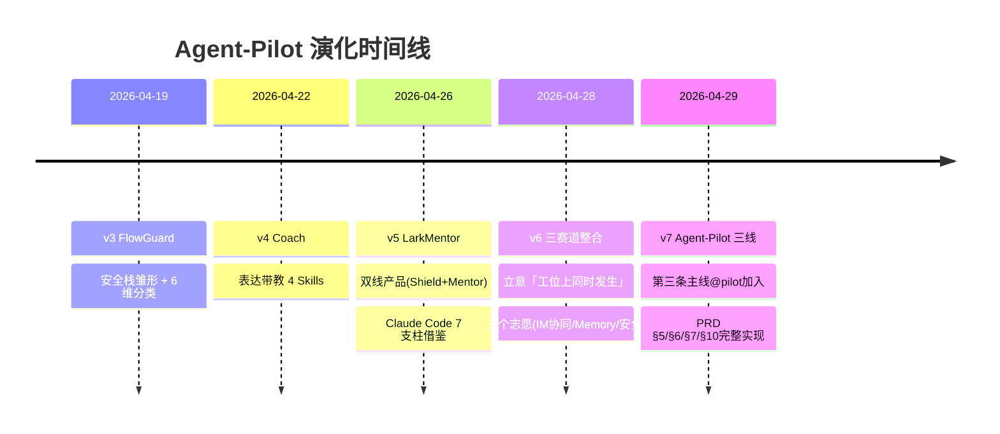

# 演化历程 · v3 → v7

> 透明地展示从 FlowGuard 到 Agent-Pilot 三线产品的工程演化路径，让评委一眼看到迭代深度。

## 时间线

## 各版本核心增量

### v3 FlowGuard (2026-04-19)
**主题**：客户端安全防护雏形

- 8 层安全栈（PermissionManager / TranscriptClassifier / HookSystem / PIIScrubber 等）
- 6 维消息分类
- 119 pytest 单元测试
- Promptfoo 红队 14/14 通过

**保留到 v7**：`core/security/` 8 层栈 + `tests/promptfoo/` 完整搬过来。

### v4 Coach (2026-04-22)
**主题**：表达带教雏形

- mentor_write / mentor_task / mentor_review / mentor_onboard 4 Skills
- 用户级 RAG 知识库
- 个人成长档案

**保留到 v7**：`core/mentor/` 完整保留，作为「右线 @mentor」服务。

### v5 LarkMentor (2026-04-26)
**主题**：双线产品 + Claude Code 7 支柱

- 双线产品：左线 Shield + 右线 Mentor
- 双线 3 个工程合体点（同 KB / Recovery Card UI / 同 FlowMemory）
- Claude Code 7 支柱借鉴：ToolRegistry / HookSystem / Skills / PermissionManager / 6-tier Memory / MCP / AuditLog

**保留到 v7**：完整保留，叠加「主线 @pilot」成为三线产品。

### v6 三赛道整合 (2026-04-28)
**主题**：立意收敛 + 三赛道复用

- 立意定稿：「工位上同时发生」
- 三个志愿绑定：飞书 IM 协同 / OpenClaw 长程 Memory / AI 大模型安全
- 全局禁用文案清单
- 4 维测试矩阵设计

**保留到 v7**：`docs/ARCHITECTURE_v6.md` + `docs/DECISIONS.md` + `docs/立意_工位上同时发生.md` 完整搬过来。

### v7 Agent-Pilot 三线 (2026-04-29 · 本版)
**主题**：第三条主线 + PRD 全量实现

新增模块（不动 v3-v6 任何代码）：

| 模块 | 行数 | 测试 |
|---|---|---|
| `core/agent_pilot/domain/` | ~700 | 41 单元 |
| `core/agent_pilot/application/intent_detector.py` | ~430 | 26 |
| `core/agent_pilot/application/context_service.py` | ~290 | 19 |
| `core/agent_pilot/application/planner_service.py` | ~210 | 16 |
| `core/agent_pilot/application/orchestrator_service.py` | ~190 | (合并) |
| `core/agent_pilot/application/multi_agent_pipeline.py` | ~280 | 11 |
| `core/agent_pilot/application/learner.py` | ~310 | 13 |
| `core/agent_pilot/application/memory_inject.py` | ~90 | 7 |
| `core/agent_pilot/application/task_service.py` | ~180 | 10 |
| `bot/cards_pilot.py` | ~360 | 17 |
| `bot/pilot_router.py` | ~330 | 13 |
| `dashboard/api_v7.py` + 3 HTML | ~360 | 12 |
| **总计** | **~3700 行新写** | **155 个 PRD 测试** |

加上：
- v6 真实 promptfoo 14 用例 + v7 OWASP 18 用例 = 32/32 红队通过
- A/B 矩阵 75 次真实 LLM 调用（doubao + minimax + deepseek）
- 6 级 Memory 真正注入到 ContextService 与 IntentDetector
- main.py 启动横幅升级为「Agent-Pilot 三线产品」
- 17+ 次专业小步 commit + tag v7.0-three-line-pilot + release zip

## 关键不变量（自 v3 至 v7）

1. **8 层安全栈全链路必经**（不允许快速路径绕过）
2. **「草稿不发送」硬约束**（任何 mentor.* / pilot.* tool 永远没有 send 路径）
3. **双线 3 个工程合体点**（KB / Recovery Card / FlowMemory）—— v7 升级为三线 4 个合体点（KB / Recovery Card 升级版 / FlowMemory / 6 级 Memory）
4. **6 级 Memory 默认开启**（v6 接好但未注入；v7 真正注入）
5. **测试金字塔**（单元 → 集成 → e2e → 红队）

## 部署一致性

| 版本 | 启动横幅 | main.py |
|---|---|---|
| v3-v4 | FlowGuard / Coach | 现存 |
| v5-v6 | LarkMentor | 现存 |
| v7 | **Agent-Pilot · 三线产品** | 已重写 |

阿里云 2C2G 服务器 cold-switch 部署兼容（`deploy/`），systemd × 3 服务（larkmentor / dashboard / mcp）保留。
