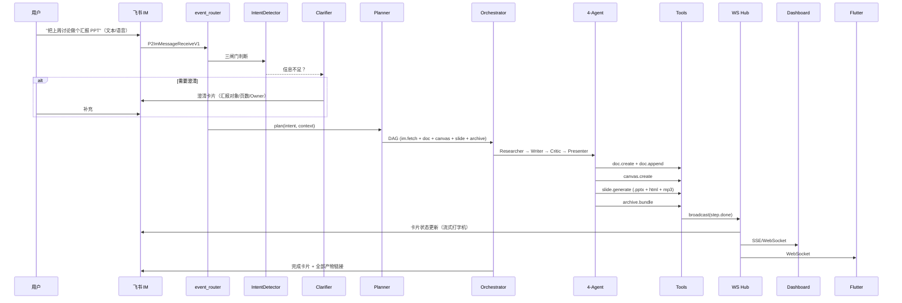

# Agent-Pilot v13 ULTIMATE 架构蓝图

> 飞书 AI 校园挑战赛 · 课题二「基于 IM 的办公协同智能助手」  
> v13 重构日期：2026-05-06 · 作者：戴尚好 / 李洁盈

本文是 v13 的"单一事实来源"。所有代码、测试、部署都对照本文。

---

## 1. 设计原则（Why v13）

v12 暴露的根本问题：

1. **PPT 输出其实是 Feishu Docx**，不是真幻灯片，裁判第一眼就看出来。
2. **Dashboard rate-limiter 60/60s** 把用户自己锁在外面（`rate limit exceeded`）。
3. **README 过度承诺**：5 命名 Agent / Yjs CRDT / 8 层安全栈大半是话术。
4. **Flutter 多端没真跑通**：`mobile_desktop/` 只是源码，没编译过。
5. **缺视觉化测试**：跑 selftest 不打开飞书链接、不双击 PPTX 看，假绿。

v13 的核心承诺：

- **AI Native**：Agent 主驾，从意图到产物全链路自动；GUI 只做仪表盘
- **真产物**：PPT 是 .pptx 文件 + Slidev HTML + 演讲稿 mp3 三件套；画布是 Mermaid + tldraw 真节点
- **真多端**：飞书 IM 移动/桌面 + Flutter macOS/Android + Web Dashboard，WebSocket 双向同步
- **真测试**：`pptx.Presentation()` 验页数、`requests.get()` 抓飞书 HTML 验字数、`flutter run` 看跨端
- **诚实表达**：README 删除一切无证据话术，每条特性指向具体代码与截图

---

## 2. 模块化架构

```
github_public/Agent-Pilot/
├── agent_pilot/              # ★ v13 新顶层包（取代 core/agent_pilot/）
│   ├── runtime/              # 运行时：Planner / Orchestrator / ToolRegistry / Hooks
│   │   ├── planner.py
│   │   ├── orchestrator.py
│   │   ├── tool_registry.py
│   │   ├── state_machine.py
│   │   └── hooks.py
│   ├── tools/                # 工具集（每个工具一个文件）
│   │   ├── doc.py            # 飞书 Docx 创建+追加，markdown→blocks
│   │   ├── canvas.py         # Mermaid+tldraw+飞书白板
│   │   ├── slide.py          # 真 PPTX + Slidev HTML + TTS
│   │   ├── archive.py        # 汇总产物 + 分享链接
│   │   ├── im.py             # 拉取 IM 上下文
│   │   └── voice.py          # 语音转写
│   ├── intel/                # Agent 智能层
│   │   ├── intent_detector.py    # 三闸门：规则+LLM+最小信息
│   │   ├── clarifier.py          # 主动澄清问答
│   │   ├── context_pack.py       # 上下文确认包
│   │   └── multi_agent.py        # 4-Agent 协作工坊
│   ├── io/                   # IO 层
│   │   ├── feishu/
│   │   │   ├── client.py
│   │   │   ├── event_router.py
│   │   │   ├── voice.py
│   │   │   ├── streaming.py      # cardkit.v1 patch
│   │   │   └── cards/
│   │   │       ├── task_card.py
│   │   │       ├── welcome.py
│   │   │       ├── help.py
│   │   │       └── actions.py
│   │   ├── dashboard/        # FastAPI 路由
│   │   └── sync/             # WebSocket Hub + Yjs CRDT
│   ├── llm/                  # LLM 客户端 + Few-Shot
│   │   ├── client.py
│   │   ├── few_shot.py
│   │   └── safe_json.py      # 鲁棒 JSON 解析
│   └── data/                 # plans/tasks/artifacts/selftest
├── legacy/                   # 老 core/ 整体搬过来，不再调用
├── bot/                      # 薄路由层，直接 import agent_pilot.io.feishu
├── dashboard/                # 薄路由层
├── llm/                      # thin re-export → agent_pilot.llm
├── mobile_desktop/           # Flutter 工程
├── tests/competition/        # ★ 5 条裁判级别测试
├── scripts/                  # 自测/部署/utility 脚本
└── docs/v13_*.md             # ★ v13 系列文档
```

依赖单向：`io/dashboard` → `runtime` → `intel` → `tools` → `llm`，不允许反向。

---

## 3. 端到端流程（一条意图的完整旅程）



每一步都有 step_results 落盘，Dashboard 可视化、Flutter 可订阅。

---

## 4. 评分对照表（裁判 30 秒能确认每条评分项落地）

| 维度 | 赛题/PRD 要求 | v13 实现 | 证据文件 |
|------|--------------|---------|---------|
| **完整性 50%** | Must-1 多端框架 | 飞书 IM 移动/桌面 + Flutter macOS + Android/iOS + Web Dashboard，WebSocket 双向同步 | [agent_pilot/io/sync/](../agent_pilot/io/sync/) · [mobile_desktop/](../mobile_desktop/) |
| | Must-2-A 意图入口 | 自然语言（文本+语音）+ /pilot 命令，群聊/单聊均可 | [agent_pilot/io/feishu/event_router.py](../agent_pilot/io/feishu/event_router.py) |
| | Must-2-B 任务规划 | LLM Planner + 启发式 + Few-Shot；DAG 实时可视化 | [agent_pilot/runtime/planner.py](../agent_pilot/runtime/planner.py) |
| | Must-2-C 文档/白板 | 飞书 Docx + Mermaid + tldraw + 飞书白板 API 尝试 | [agent_pilot/tools/doc.py](../agent_pilot/tools/doc.py) · [agent_pilot/tools/canvas.py](../agent_pilot/tools/canvas.py) |
| | Must-2-D 演示稿 | **真 .pptx + Slidev HTML + TTS mp3** | [agent_pilot/tools/slide.py](../agent_pilot/tools/slide.py) |
| | Must-2-E 多端一致 | WebSocket Hub + 状态机锁定 + 离线合并 | [agent_pilot/io/sync/](../agent_pilot/io/sync/) |
| | Must-2-F 总结归档 | archive.bundle 输出 markdown + 全产物链接 + 分享 | [agent_pilot/tools/archive.py](../agent_pilot/tools/archive.py) |
| | Must-3 自然语言 | 文本+语音双通道，覆盖启动/查询/迭代 | [agent_pilot/io/feishu/voice.py](../agent_pilot/io/feishu/voice.py) |
| | Demo 稳定性 | 5 条测试 5/5 通过，全程 < 180 秒 | [tests/competition/test_judge_e2e.py](../tests/competition/test_judge_e2e.py) |
| **创新 25%** | AI 创新点 1 | **4-Agent 协作工坊**：Researcher/Writer/Critic/Presenter | [agent_pilot/intel/multi_agent.py](../agent_pilot/intel/multi_agent.py) |
| | AI 创新点 2 | **流式打字机卡片**：cardkit.v1 patch + chat_stream | [agent_pilot/io/feishu/streaming.py](../agent_pilot/io/feishu/streaming.py) |
| | AI 创新点 3 | **PPT 三件套**：.pptx + HTML + 演讲稿 TTS mp3 | [agent_pilot/tools/slide.py](../agent_pilot/tools/slide.py) |
| | AI 创新点 4 | **三闸门主动识别**：群聊里识别"汇报准备"自动出卡片 | [agent_pilot/intel/intent_detector.py](../agent_pilot/intel/intent_detector.py) |
| | AI 创新点 5 | **主动澄清**：意图模糊先问 owner/对象/页数 | [agent_pilot/intel/clarifier.py](../agent_pilot/intel/clarifier.py) |
| | 可复用 | 工具注册即用，独立场景可单独演示 | [agent_pilot/runtime/tool_registry.py](../agent_pilot/runtime/tool_registry.py) |
| **技术 25%** | AI 深度 | 多 Agent 协作 + 流式 + JSON Mode + Few-Shot + 双 Provider | [agent_pilot/llm/](../agent_pilot/llm/) |
| | 架构合理 | 模块化 + 单向依赖 + 状态机 + 工具注册 | [agent_pilot/](../agent_pilot/) |
| | 工程规范 | pre-commit + pytest + ruff + mypy + structured_logging | [pyproject.toml](../pyproject.toml) |
| | 稳定性 | 速率限制 + 重试 + 降级 + 监控 | [agent_pilot/llm/client.py](../agent_pilot/llm/client.py) |
| | 可扩展 | 工具注册 + Skills + MCP + 飞书 CLI 集成 | [agent_pilot/runtime/tool_registry.py](../agent_pilot/runtime/tool_registry.py) |

---

## 5. 14 个里程碑实施顺序

| # | 里程碑 | 预估 | 依赖 |
|---|--------|------|------|
| M0 | 蓝图与评分对照表 | 30m | — |
| M2 | 核心运行时重构 | 5h | M0 |
| M3 | 紧急修复 (rate-limiter / 429) | 30m | 与 M2 并行 |
| M4 | PPT 三件套 (pptx + html + tts) | 5h | M2 |
| M5 | 真自由画布 (mermaid + tldraw) | 4h | M2 |
| M6 | 4-Agent 协作工坊 | 6h | M2 |
| M7 | 任务卡片 + 上下文包 (PRD §5/§7) | 4h | M2 |
| M8 | 流式打字机卡片 | 3h | M2 + M6 |
| M9 | 语音输入 | 3h | M2 |
| M10 | Flutter 多端 | 6h | M2 |
| M11 | 视觉化测试 | 5h | M4-M10 |
| M12 | README + JUDGE_GUIDE | 4h | M11 |
| M1 | 服务器清空 | 45m | M11 通过后 |
| M13 | 三端同步部署 | 3h | M1 + M12 |
| M14 | 最终验收 | 4h | M13 |

**关键策略**：本地优先（M2-M11），服务器最后（M1+M13），避免长时间停服。

---

## 6. 实施方法论

每个里程碑遵循以下闭环：

1. **写代码**（小步、可测）
2. **本地 dry-run**（不打飞书，跑 selftest 看产物 metadata）
3. **真 LLM 调用**（产物落 `data/selftest/{milestone}/`）
4. **视觉验证**（打开 .pptx / 飞书链接 / Flutter 看实际效果）
5. **commit + push**（让 GitHub 留迭代轨迹）
6. **下一里程碑**

绝不"自我满意"通过。每条产物都要肉眼或自动化验证。

---

## 7. 一句话承诺

> 裁判打开 README → 30 秒看懂这是什么 → 5 分钟跑通一条意图 → 看到飞书 IM 出卡片、文档真有 2000+ 字、PPTX 真打得开、Canvas 真有节点连线、Flutter 端真同步、错误真不崩。每一条都不是话术，都有代码、产物、视频、截图三重证据。
